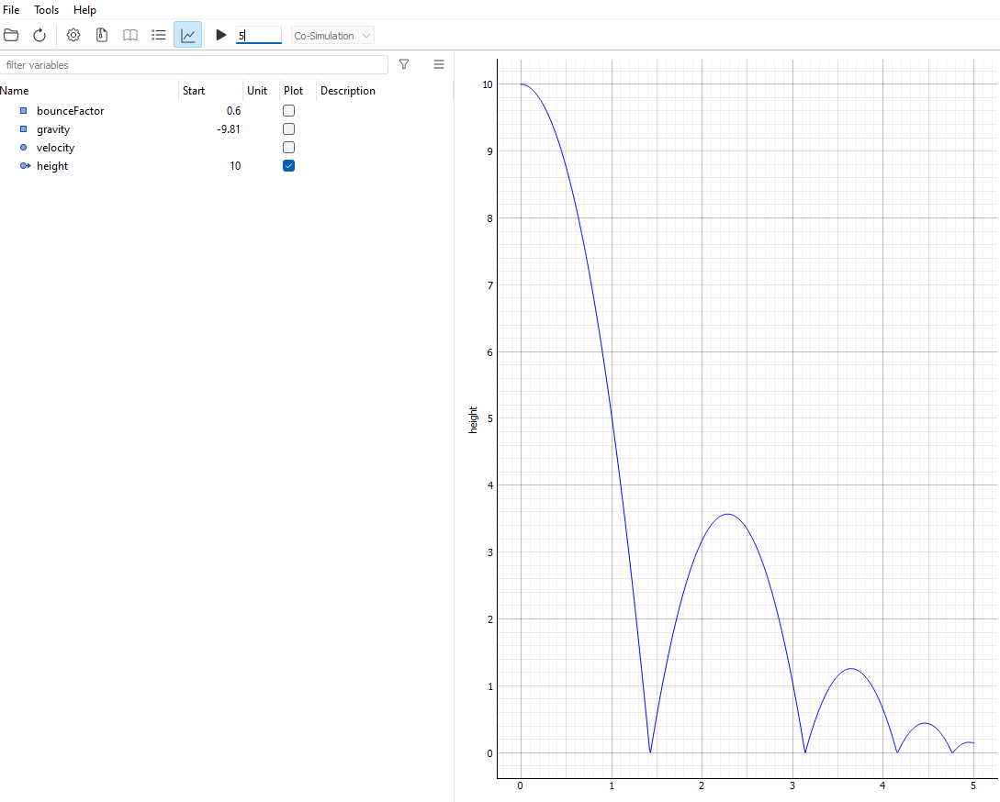

# Summary

FMU4cpp is a CMake template repository that acts as a framework for creating 
Functional Mockup Units (FMUs) compatible with the Functional Mockup Interface (FMI) standard [@blochwitz2011functional]
in idiomatic C++. The FMI is an open standard for model exchange and co-simulation of dynamic systems. 
Currently, version 2.0 for Co-simulation [@blochwitz2012functional] is supported.
In short, an FMU (Functional Mock-up Unit) is a self-contained component that implements the FMI standard.
It is packaged as a zip archive containing:
- A shared library for each supported platform, which implements a standardized C interface.
- A *modelDescription.xml* file, describing the FMU's capabilities and available variables.
- Optionally, component-specific resources embedded within the archive.

The intention of FMU4cpp is to provide a streamlined way of generating such FMUs based on C++ source code.
To do so, the framework provides skeleton code for the user to implement, 
so that many of the low level details of the FMI standard is abstracted away. 
Furthermore, it handles generating the required XML as well as packaging the model according to the requirements. 
To further simplify model creation, the framework utilizes GitHub Actions in order to automatically build and 
package cross-platform FMUs.
When the users push their changes to GitHub, the model is verified against standard conformance and built 
on an Ubuntu and Windows runner. 
The resulting shared libraries are then joined into a final archive which can be directly downloaded and 
imported into a simulation tool.

\autoref{fig:bb} demonstrates simulation of a simple *BouncingBall* model generated with FMU4cpp within the Python simulation library FMPy [@FMPy].
Similarly, the generated FMU can be imported into any of the many available simulation tools compatible with FMI 2.0 for Co-simulation.

# Statement of need

A survey of existing open-source software that facilitates exporting FMUs from source-code is shown in Table 1.

Table 1: Survey of existing open-source FMI exporters.

|               Name                | Language | Most recent Update |
|:---------------------------------:|:--------:|:------------------:|
|         FMU4j   [@fmu4j]          |   Java   |        2022        |
|        JavaFMI  [@javafmi]        |   Java   |        2021        |
|        cppfmu   [@cppfmu]         |   C++    |        2024        |
| Reference FMUs [@reference_fmus]  |    C     |        2024        |
| PythonFMU [@hatledal2020enabling] |  Python  |        2024        |
|  unifmu [@legaard2021universal]   | Multiple |        2024        |

The non-native solutions listed here provide similar capabilities as FMU4cpp,
however the native solutions require a substantial expert knowledge
and users are required to manually generate XML metadata as well as packaging the necessary files into an FMU.
Thus, FMU4cpp provides a significant usability improvement over these alternatives as it:
1. Provides a simplified API to implement. 
2. Generates the required XML metadata.
3. Verifies the FMU against the standard.
4. Cross-compiles the shared library.
5. Packages the FMU.

A framework like FMU4cpp is useful for generating both simple and more complex models that does not fit with the restrictions
of a specialized modelling tools. Targeting C++ is also useful compared to similar solutions for Python and Java,
as a runtime is not necessarily required to invoke the model, increasing portability.

# Future of FMU4cpp

With FMI 3.0 [@junghanns2021functional] released in 2022, an obvious and planned enhancement 
to FMU4cpp is to support this newer version of the standard. While version 2.0 of the standard is still the most widely supported by importing tools, 
adding support through FMU4cpp would further drive adoption and accommodate more effective simulations.

# References